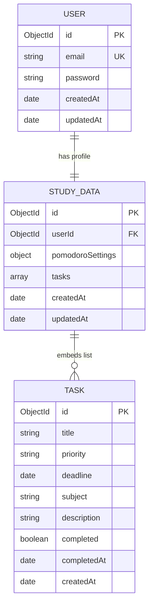

# 📚 StudyFlow: AI-Powered Study Planner Dashboard

[](https://nodejs.org/)
[](https://expressjs.com/)
[](https://react.dev/)
[](https://www.mongodb.com/)
[](https://redis.io/)
[](https://www.postgresql.org/)
[](https://vitejs.dev/)

An enterprise-ready, high-performance study planner dashboard application designed to coordinate academic subjects, tasks, and calendar events. It incorporates a customizable Pomodoro focus timer, mathematical AI study planning assistance, and comprehensive analytics charts. Built on a modern decoupled architecture using an **Express/Node.js** REST API and a **React/Vite** Single Page Application, backed by a dual-tier **MongoDB & Redis** caching storage system.

---

## 🌟 Executive Summary & Key Value Prop

For students and self-learners managing complex workloads, poor task prioritization and burnout are persistent challenges. **StudyFlow** addresses these challenges by introducing:
1. **AI-Driven Study Planning**: An algorithmic prioritizing engine that evaluates deadline urgency alongside priority weightings to dynamically recommend daily focus goals.
2. **Customizable Pomodoro Engine**: An integrated interval timer allowing customizable focus-and-break sessions, keeping track of focus durations and completed cycles.
3. **Dual-Tier Cache Performance**: Sub-millisecond data delivery powered by Redis caching for user sessions and paginated dashboard payloads, ensuring seamless operation even under load.
4. **Interactive Analytical Graphs**: Beautiful charts generated dynamically using Recharts to present productivity metrics and tasks distribution.

---

## 🏗️ System Architecture & Data Flow

The application is structured around a decoupled system architecture communicating via JSON payloads over a RESTful API.

```mermaid
graph TD
    subgraph Client [Frontend SPA - React / Vite]
        UI[Glassmorphism UI - CSS & Lucide] --> Charts[Recharts Visualization]
        UI --> Pomodoro[Pomodoro Timer State]
        Charts --> Fetch[Native Fetch API Client]
        Fetch --> AuthState[Session Token Management]
    end

    subgraph API [Backend Server - Node.js / Express]
        Fetch --> Cors[CORS Middleware]
        Cors --> JWT[JWT Auth Middleware]
        JWT --> CacheCheck{Redis Cache Lookup}
        
        CacheCheck -- Hit (Sub-ms) --> Respond[JSON Response]
        CacheCheck -- Miss --> Controller[Route Controller Logic]
        Controller --> Mongo[Mongoose ODM]
    end

    subgraph Storage [Storage Layer - Dual Database]
        Mongo --> MongoDB[(MongoDB Atlas)]
        Controller --> Redis[(Redis Cache Store)]
        Controller -. Future Extension .-> PG[(PostgreSQL Pool)]
    end
```



---

## 🧠 Core Engineering Features & Deep Dives

### 1. AI Task Prioritization Algorithm
The dashboard features a deterministic prioritization engine that sorts outstanding tasks. Rather than sorting tasks arbitrarily, it calculates a weighted urgency score ($S_t$) for each active task:

$$S_t = W_{\text{priority}} - 2 \cdot \max(T_{\text{remaining}}, 0)$$

Where:
* $W_{\text{priority}}$ is a numerical weight assigned based on task priority: **High** = 30, **Medium** = 20, and **Low** = 10.
* $T_{\text{remaining}}$ represents the number of days remaining until the deadline date:
  $$T_{\text{remaining}} = \left\lceil \frac{\text{Deadline} - \text{Current Date}}{86,400,000\text{ ms}} \right\rceil$$

The engine extracts the top three tasks with the highest $S_t$ scores and generates suggested focus durations:
* **High Priority**: 2.0 hours
* **Medium Priority**: 1.5 hours
* **Low Priority**: 1.0 hour

*Implementation Reference:* [`study-planner/src/App.jsx` > `generateStudyPlan`](file:///c:/Users/Asus/OneDrive/Desktop/project-3%20for%20inturnship-2/study-planner/src/App.jsx#L135-L152)

### 2. High-Performance Two-Tier Redis Caching
To optimize query performance and reduce database load, the backend features a robust cache-aside layer:
* **User Session Cache**: Authenticated user profiles are cached under `user:email:${email}` for **24 hours**. Subsequent sign-ins verify credentials directly against Redis before querying MongoDB.
* **Dashboard Payload Cache**: The user's study tasks and timer configuration are cached under `user:dashboard:${userId}:${limitStr}:${offset}` for **1 hour**.
* **Atomic Cache Invalidation**: Upon creating or updating dashboard tasks, the backend uses a cursor-based `SCAN` pattern (`user:dashboard:${userId}:*`) to locate and evict all related cache slices, ensuring eventual consistency.

*Implementation Reference:* [`server/routes/dashboard.js`](file:///c:/Users/Asus/OneDrive/Desktop/project-3%20for%20inturnship-2/server/routes/dashboard.js) & [`server/routes/auth.js`](file:///c:/Users/Asus/OneDrive/Desktop/project-3%20for%20inturnship-2/server/routes/auth.js)

### 3. Database Schema Design
The application utilizes Mongoose to manage data schemas in MongoDB, mapping out user registration profiles and nested dashboard datasets.



To ensure speedy pagination and analytics aggregation, the system configures compound indexes on queried and filtered fields:
* Index on task completion status: `tasks.completed: 1`
* Index on task priority: `tasks.priority: 1`
* Index on task deadline: `tasks.deadline: 1`
* Index on task creation date (descending): `tasks.createdAt: -1`

*Implementation Reference:* [`server/models/StudyData.js`](file:///c:/Users/Asus/OneDrive/Desktop/project-3%20for%20inturnship-2/server/models/StudyData.js)

---

## 🛠️ Tech Stack & Technical Decisions

| Layer | Component | Choice | Rationale |
| :--- | :--- | :--- | :--- |
| **Frontend** | Framework | React 19 & Vite 8 | Minimal overhead, lightning-fast Hot Module Replacement (HMR), and optimized production builds. |
| | Visual Layout | Glassmorphism & Lucide | Modern dark-theme aesthetic leveraging backdrop filters to deliver an elegant experience. |
| | Visualization | Recharts | Declarative SVG-based charting tailored for responsive React dashboards. |
| **Backend** | Runtime Environment | Node.js & Express 5 | Fast, event-driven, and non-blocking architecture perfect for handling asynchronous JSON APIs. |
| | Session Validation | jsonwebtoken | Stateless authentication model reducing database sessions overhead. |
| **Database** | Primary Store | MongoDB & Mongoose 9 | Flexible document-based storage that maps natively to JSON data models. |
| | Caching Layer | Redis 6 | In-memory key-value store enabling sub-millisecond API response latency. |
| | Future Database | PostgreSQL 8 (Pool) | Pre-configured connection pool (max 20 client pools) initialized for future SQL migrations. |

---

## 📂 Project Structure & Clean Code Organization

```
project-3-for-internship-2/
├── study-planner/              # Frontend Web Application (React + Vite)
│   ├── src/
│   │   ├── App.jsx             # Main Application shell, routing & dashboard views
│   │   ├── index.jsx           # React app mount point
│   │   └── style.css           # Global custom layout stylings
│   ├── public/                 # Static assets and icons
│   ├── package.json            # Frontend dependencies (Lucide, Recharts, Vite)
│   └── vite.config.js          # Vite build configurations
│
└── server/                     # Backend REST API Service (Node + Express)
    ├── config/
    │   ├── db.js               # MongoDB Mongoose connection setup (maxPoolSize: 20)
    │   ├── redis.js            # Redis client connection and connection event handlers
    │   └── pg.js               # PostgreSQL pool config (max: 20 pool clients)
    ├── middleware/
    │   └── auth.js             # JWT bearer verification and request context mapping
    ├── models/
    │   ├── User.js             # Mongoose User credentials schema
    │   └── StudyData.js        # Mongoose Dashboard schema with nested Task sub-document
    ├── routes/
    │   ├── auth.js             # Authentication routes (Sign-up, Cache-aside Login)
    │   └── dashboard.js        # Private routes (Paginated fetch, Save, Cache invalidation)
    ├── server.js               # Main application bootstrapper and entry point
    └── package.json            # Backend dependency manifests
```

---

## 🔌 API Reference & Endpoints

### Authentication Endpoints
| HTTP Method | Route | Access | Request Payload | Description |
| :--- | :--- | :--- | :--- | :--- |
| `POST` | `/api/auth/register` | Public | `{ "email", "password" }` | Registers a new account. Hashes passwords using bcrypt, clears email cache, and returns signed JWT. |
| `POST` | `/api/auth/login` | Public | `{ "email", "password" }` | Validates credentials against cached Redis profile (falls back to MongoDB on cache miss) and returns JWT. |

### Dashboard & Task Endpoints
| HTTP Method | Route | Access | Query Parameters | Request Payload | Description |
| :--- | :--- | :--- | :--- | :--- | :--- |
| `GET` | `/api/dashboard` | **Private** | `?limit=5&offset=0` | *None* | Retrieves the authenticated user's tasks and Pomodoro settings. Returns paginated slicing and caches JSON response. |
| `POST` | `/api/dashboard` | **Private** | *None* | `{ "tasks", "pomodoroSettings" }` | Creates or updates user's tasks. Triggers multi-key Redis cache invalidations using `SCAN`. |

---

## 🚀 Quick Start Guide

### 1. Prerequisites
Ensure you have the following services installed:
* [Node.js](https://nodejs.org/) (v18.0.0 or higher)
* [MongoDB](https://www.mongodb.com/) (Local server or MongoDB Atlas Cluster)
* [Redis](https://redis.io/) (Running locally on default port `6379`)

### 2. Backend API Setup
1. Open your terminal and navigate to the `server` directory:
   ```bash
   cd server
   ```
2. Install npm dependencies:
   ```bash
   npm install
   ```
3. Create a `.env` file in the `server` directory:
   ```env
   PORT=5000
   MONGO_URI=mongodb+srv://<username>:<password>@cluster.mongodb.net/studyPlannerDB?retryWrites=true&w=majority
   REDIS_URL=redis://127.0.0.1:6379
   JWT_SECRET=your_super_cryptographic_jwt_secret_string
   NODE_ENV=development
   ```
4. Start the development server:
   ```bash
   npm run dev
   ```
   *Console output should show:*
   `MongoDB Connected: ...`
   `Redis Client Connected`
   `Server is running in development mode on port 5000`

### 3. Frontend Web App Setup
1. Open a new terminal and navigate to the `study-planner` directory:
   ```bash
   cd study-planner
   ```
2. Install npm dependencies:
   ```bash
   npm install
   ```
3. Create a `.env` file in the `study-planner` directory:
   ```env
   VITE_API_URL=http://localhost:5000/api
   ```
4. Boot up the Vite dev server:
   ```bash
   npm run dev
   ```
5. Navigate to the local URL (default: `http://localhost:5173`) in your browser.

---

## 🔐 Security Best Practices Implemented

* **Cryptographic Hashing**: User passwords are saved as salted hashes via `bcryptjs` (salt factor 10) to prevent credential disclosure.
* **Token-Based Stateless Auth**: Secure JWT tokens enforce access control without storing backend session states, minimizing memory leak targets.
* **Cache Isolation**: Caching structures are scoped strictly with the request context's verified user ID (`req.user.id`), eliminating cache poisoning risks.
* **Env-Guard Protection**: Sensitive credentials, database URIs, and authentication tokens are kept in ignored `.env` config files to prevent exposure to remote Git servers.

---

## 📄 License
This project is licensed under the MIT License. See the [LICENSE](LICENSE) file for details.
